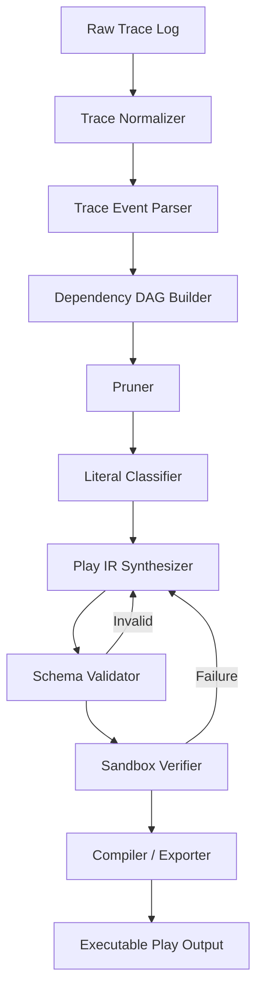

# Synaptic Pruner: Developer-Ready Architecture

## 1. Overview

Synaptic Pruner is a TypeScript-based local pipeline that converts raw terminal and agent execution traces into a deterministic, executable program representation. The system ingests noisy shell logs, reconstructs causal execution paths, removes dead exploratory branches, generalizes raw literals into invariants, validates the resulting program in an isolated sandbox, and emits a safe intermediate representation called Play IR.

The architecture is intentionally split into deterministic and model-assisted phases:

- Deterministic phase: parsing, graph reconstruction, pruning, validation, canonicalization, and schema checks
- Model-assisted phase: semantic invariant extraction and Play IR synthesis

This separation keeps the system reliable, testable, and repeatable while still allowing LLM-driven generalization when needed.

---

## 2. Goals and Non-Goals

### Goals

- Transform unstructured command histories into structured execution semantics
- Eliminate failed retries, dead-end branches, and exploratory noise
- Preserve only the causal sequence that produced a successful state transition
- Standardize output into a machine-readable Play IR
- Verify behavior in an isolated sandbox without touching host state
- Produce executable logic that is deterministic and idempotent

### Non-Goals

- Not a general-purpose shell automation framework
- Not a full conversational memory system for long-lived chatting
- Not a tool that runs untrusted command generation on the host machine
- Not a free-form LLM workflow with no validation boundary
- Not designed to replay or parse complex interactive TUI applications (e.g., vim, nano, htop)

---

## 3. High-Level Architecture



### Architectural Principles

1. Deterministic-first processing
2. Explicit data contracts and schemas
3. No host-side execution for untrusted generated commands
4. Verified state equivalence before final compilation
5. Strict separation between generation and validation

---

## 4. System Components

| Layer | Module | Responsibility |
|---|---|---|
| Ingestion | `traceParser.ts` | Convert raw terminal text into structured `TraceEvent` records |
| Ingestion | `ansiStripper.ts` | Remove ANSI/control sequences and normalize logs |
| Synthesis | `dagBuilder.ts` | Build causal DAG from execution events |
| Synthesis | `pruner.ts` | Remove dead retries, error branches, and exploratory noise |
| Synthesis | `classifier.ts` | Categorize sample values, constants, invariants, and system identifiers |
| Synthesis | `synthesizer.ts` | Generate Play IR from the causal graph and generalized rules |
| Verifier | `canonicalizer.ts` | Normalize output before equivalence checks |
| Verifier | `fuzzer.ts` | Create edge-case permutations and negative tests |
| Verifier | `sandbox.ts` | Execute candidate Play IR in a controlled temporary environment |
| Compiler | `validator.ts` | Validate the IR against schema and rules |
| Compiler | `roteExporter.ts` | Compile verified Play IR into executable output |
| Runtime | `bin/run.ts` | CLI entry point for full processing pipeline |

---

## 5. Runtime Boundary and Execution Model

### Execution Flow

1. Input arrives as raw terminal transcript, shell output, or structured tool event log.
2. The parser sanitizes control characters and splits data into discrete execution units.
3. The graph builder reconstructs dependencies by tracing file changes, command success/failure, and result propagation.
4. The pruner drops nodes that failed or did not contribute to the final state.
5. The generalizer identifies the semantic category of each literal.
6. The synthesizer emits Play IR in a declarative structure.
7. The sandbox executes the candidate IR against sample and fuzzed inputs.
8. If verification passes, the compiler exports the validated Play.

### Execution Policy

- No shell command generated during verification may run on the host machine directly.
- All runtime validation happens inside a transient sandbox directory.
- Failures produce structured diagnostics, not silent retries.
- The system supports a maximum retry loop for regeneration only when validation fails.

---

## 6. Data Contracts

### 6.1 TraceEvent

```ts
export interface TraceEvent {
  id: string;
  timestamp: string;
  command: string;
  cwd: string;
  exitCode: number;
  stdout: string;
  stderr: string;
  fsMutations: Array<{
    path: string;
    action: "CREATE" | "MODIFY" | "DELETE";
    byteSize?: number;
  }>;
}
```

### 6.2 ExecutionNode

```ts
export interface ExecutionNode {
  id: string;
  eventId: string;
  kind: "command" | "file" | "condition" | "result";
  command?: string;
  exitCode?: number;
  reads: string[];
  writes: string[];
  parentIds: string[];
  childIds: string[];
  causalScore: number;
}
```

### 6.3 PlayIR

```yaml
---
schema_version: "1.0.0"
operation_id: "normalize_dataset_records"
metadata:
  description: "Deduplicates and normalizes input records"
  author: "synaptic-pruner"
  deterministic: true

inputs:
  source_file:
    type: "path"
    description: "Input JSON payload"
    required: true
  output_dest:
    type: "path"
    description: "Target output file"
    default: "./output/normalized.json"

preconditions:
  - assertion: "file_exists"
    target: "{{inputs.source_file}}"
  - assertion: "file_extension"
    target: "{{inputs.source_file}}"
    expected: ".json"

actions:
  - id: "step_1"
    runtime: "fs"
    action: "make_directory"
    target: "{{dirname inputs.output_dest}}"
    idempotent: true

postconditions:
  - assertion: "file_exists"
    target: "{{inputs.output_dest}}"

safety_boundary:
  network_access: false
  allowed_write_paths:
    - "{{dirname inputs.output_dest}}"
```

---

## 7. Detailed Module Design

### 7.1 Ingestion Layer

#### Purpose

Collect raw shell or tool traces and normalize them into a consistent event stream.

#### Responsibilities

- Remove ANSI sequences and line-noise artifacts
- Split transcript into command blocks
- Detect exit status and stderr/stdout boundaries
- Extract filesystem mutation summaries
- Attach `cwd`, timestamp, and metadata for each event

#### Failure Modes Handled

- Mixed interactive shells and agent wrappers
- Carriage-return updates (`\r`) and progress bars
- Unstructured transcript fragments
- Incomplete command blocks

### 7.2 Causal DAG Layer

#### Purpose

Map the effective execution path without replaying unrelated exploration.

#### Responsibilities

- Identify successful terminal anchor events
- Traverse backwards from outcome to cause
- Link commands to read/write dependencies
- Build a directed acyclic graph of causally relevant events

#### Key Rule

If a file write is never consumed by the surviving branch, it is discarded as non-causal.

### 7.3 Pruning Layer

#### Purpose

Remove explored branches that do not contribute to the final successful state.

#### Deterministic Rules

- Drop all failed terminal events and their immediate debug branches
- Collapse retry loops into a winning final command
- Remove read-only exploratory commands unless their output is connected to a surviving mutation
- Keep only terminal state transitions that survive causal slicing

### 7.4 Generalization Layer

#### Purpose

Prevent shortcut learning by classifying all literals before synthesis.

#### Categories

| Category | Rule |
|---|---|
| Sample Data | Parameterize |
| Protocol Constant | Preserve verbatim |
| Domain Invariant | Preserve as validation rule |
| System Identifier | Replace with runtime placeholder |

Example:

- `test_data_v1.csv` -> parameter input
- `application/json` -> fixed protocol value
- `.json` -> domain invariant
- `/home/shubham` -> system dynamic path

### 7.5 IR Synthesis Layer

#### Purpose

Emit a declarative execution contract instead of raw shell content.

#### Outputs

- `inputs` section with parameter descriptions
- `preconditions` validating required state
- `actions` list with idempotent shell steps
- `postconditions` ensuring output validity
- `safety_boundary` describing execution limitations

### 7.6 Verification Layer

#### Purpose

Validate the generated play against expected behavioral invariants.

#### Verification Types

- Structural equivalence using canonicalized state comparison
- Fuzzing with filename permutations and nested paths
- Negative boundary checks for invalid input
- Idempotency checks for repeated execution

The deterministic sandbox execution isolates the tests, ensuring the generated IR cannot bypass validation by reading the verification source files or relying on external state.

### 7.7 Compiler Layer

#### Purpose

Convert validated IR into final executable play or compiled artifact.

#### Responsibilities

- Validate schema compliance
- Expand variables and defaults
- Emit executable runtime representation
- Ensure portability to the local CLI target

---

## 8. Component Interaction and Data Flow

```text
Input Log
   ↓
Sanitize + Parse
   ↓
Build Causal DAG
   ↓
Prune Dead Paths
   ↓
Classify Literals
   ↓
Synthesise Play IR
   ↓
Validate Schema
   ↓
Run Sandbox Verification
   ↓
Compile Final Play
```

Like a data pipeline, each stage should be independently testable. No stage should depend on hidden runtime state from a previous run.

---

## 9. Boundary Conditions and Safety Rules

### Safety

- No direct execution of generated shell commands on the host
- Runtime verification restricted to a temporary sandbox path
- Only scoped output directories may be written
- Network access must be disabled unless explicitly required

### Determinism

- Same input trace must produce the same pruned DAG
- Same stable inputs must produce equivalent Play IR
- Output comparison must ignore volatile metadata, such as timestamps or ephemeral IDs

### Failure Handling

- Validation errors must record exact failing assertion and impacted node
- Retry generation is capped at a small number of iterations
- Build fails cleanly with a machine-readable diagnostic payload

---

## 10. Anticipated Failure Patterns

| Pattern | Example | Handling |
|---|---|---|
| Retry loops | `npm install X` repeated with flags | Collapse to winning command |
| Terminal noise | `ls`, `pwd`, `which` | Drop unless they feed the surviving branch |
| Hidden sample values | `data_01.json` | Convert to parameterized input |
| Incorrect protocol literals | `application/xml` vs `application/json` | Preserve as invariants |
| Non-causal writes | Temporary debug files | Remove from final graph |
| Invalid inputs | Empty JSON / malformed payload | Fail in preconditions with no side effects |

---

## 11. Non-Functional Requirements

### Performance

- Parse and normalize logs efficiently for moderate-size traces
- Keep graph construction linear or near-linear with respect to event volume
- Avoid LLM calls during pruning and validation

### Reliability

- Strict schemas at every boundary
- Deterministic behavior for equivalent traces
- Clear recovery path for invalid candidate Play IR

### Maintainability

- Single responsibility per module
- Explicit interfaces and typed contracts
- Test fixtures for representative failure and success cases

---

## 12. Recommended Directory Structure

```text
synaptic-pruner/
├── bin/
│   └── run.ts
├── config/
│   └── compiler.config.json
├── schemas/
│   ├── traceEvent.schema.json
│   └── playIR.schema.json
├── src/
│   ├── index.ts
│   ├── cli/
│   │   └── commandRunner.ts
│   ├── ingestion/
│   │   ├── ansiStripper.ts
│   │   └── traceParser.ts
│   ├── synthesis/
│   │   ├── dagBuilder.ts
│   │   ├── pruner.ts
│   │   ├── classifier.ts
│   │   └── synthesizer.ts
│   ├── verifier/
│   │   ├── canonicalizer.ts
│   │   ├── fuzzer.ts
│   │   └── sandbox.ts
│   ├── compiler/
│   │   ├── validator.ts
│   │   └── roteExporter.ts
│   └── types/
│       ├── trace.ts
│       ├── graph.ts
│       └── playIR.ts
├── tests/
│   ├── fixtures/
│   │   ├── raw_npm_loop.log
│   │   ├── raw_powershell.log
│   │   └── raw_data_pipeline.log
│   └── integration/
│       └── pipeline.test.ts
├── package.json
├── tsconfig.json
├── README.md
└── .gitignore
```

---

## 13. Implementation Roadmap

### Phase 1: Core Engine

- Trace parsing and sanitization
- Event modeling
- DAG construction
- Dead-path pruning

### Phase 2: Generalization and IR

- Literal categorization
- Play IR schema
- IR synthesis and validation

### Phase 3: Verification

- Fuzzed inputs
- Canonical state comparison
- Idempotency checks
- Isolated sandbox execution

### Phase 4: Compiler and CLI

- Final export pipeline
- CLI entry and config support
- Full integration testing

---

## 14. Acceptance Criteria

The architecture is considered implementation-ready when the following are true:

1. A raw trace can be normalized into typed `TraceEvent` objects.
2. A causal DAG can be built from the final successful path only.
3. Failed branches and retry loops are removed deterministically.
4. Literal classification splits sample data, invariants, protocol values, and system identifiers.
5. A valid Play IR can be generated without direct shell scripting by the LLM.
6. Candidate Play IR can be executed in isolation with no host mutation.
7. The output passes idempotency and canonical equivalence checks.
8. The compiled artifact is stable and repeatable across equivalent traces.

---

## 15. Final Design Summary

Synaptic Pruner is designed as a disciplined, deterministic processing pipeline rather than a loosely orchestrated LLM workflow. Its architecture centers on a clear separation between causal reconstruction, validation, and synthesis. This ensures that noisy command histories become reproducible execution logic without inheriting the instability of raw conversational memory.

The end result is a system that remembers the algorithm, not the drift: a repeatable, sandbox-verified, development-friendly execution engine for local trace-to-program synthesis.
